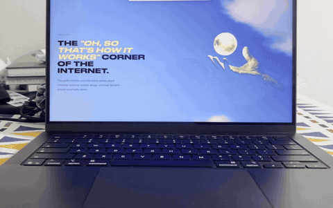

# DuoBook

Your desktop, reprojected through a hinged pane of frosted glass, driven by the
real lid angle of your MacBook.

Close the lid and the screen leans back into the hinge, blurs and dims. Open it
and everything unfolds into place. There is no canned animation in here — the
hinge angle comes off the same HID sensor macOS uses, polled at 120 Hz, so the
effect tracks the physical motion of your hand.

The optics are a port of [FrostFold](https://github.com/askmaddyy/FrostFold),
which does the same thing on iPhone using device tilt.



One take, no cuts, filmed on a phone.
[Full-resolution video](docs/demo.mp4). The site on screen is
[AskMaddyy.com](https://askmaddyy.com).

## Requirements

- macOS 14 or later
- A MacBook with a lid angle sensor (most 2019 and newer)
- Screen Recording permission, granted once on first launch

## Build

```bash
./build.sh             # -> build/DuoBook.app
open build/DuoBook.app
```

`build.sh` signs with your Developer ID if the keychain has one, otherwise
ad-hoc. Ad-hoc builds get a fresh identity every time, so macOS asks for Screen
Recording access again on every rebuild — that is expected, and it goes away
once you sign with a real identity.

`release.sh` produces a universal, notarized, stapled DMG. See the header of
that file for the one-time `notarytool store-credentials` step.

## How it works

**`LidAngle.swift`** — HID sensor page `0x20`, usage `0x8A`. Feature report 1
is three bytes: report id, then the hinge angle in whole degrees as a
little-endian `Int16`.

The device only *pushes* an input report about once a second, which is nowhere
near enough to drive an animation. So this polls the feature report on a
dedicated thread instead: a read costs about 1.2 ms and always returns the
current angle. Polling runs at display rate while the fold is live and drops to
12 Hz when the lid is parked, so an open laptop costs nothing.

**`Capture.swift`** — ScreenCaptureKit streams the built-in display as BGRA.
The IOSurface is wrapped as an `MTLTexture` directly, with no CPU copy. Two
things that will bite you here: idle and blank frames carry a surface with no
new content, and using one paints the overlay black; and the content query must
run with `onScreenWindowsOnly: false`, because the overlay window is still
hidden when the filter is built and if the app is missing from that list nothing
gets excluded and the overlay captures itself into a black recursive tunnel.

**`Overlay.swift`** — a borderless, non-activating `NSPanel` at `.screenSaver`
level, click-through, on every Space. It stays hidden until the first frame is
drawn, so there is never a black flash.

**`Shader.metal`** — a port of FrostFold's shader with the hinge moved from a
vertical screen edge to the bottom edge of the panel. The desktop stays on a
fixed plane; the glass rotates around the hinge and rises toward a stationary
eye. Each pixel is placed on the rotated glass, a ray is cast from the eye
through it onto the plane, and the result is blurred with a Vogel disk whose
radius follows the glass-to-plane gap. The disk is rotated per pixel by a hash
so the tap pattern dithers instead of banding. Rays that miss the desktop come
back black. Everything runs on a virtual canvas 1000 units tall, so one set of
tunables works at any resolution and FrostFold's own tuning transfers unchanged.

**`Engine.swift`** — a critically damped spring on the fold amount, advanced on
the display link rather than on captured frames, so a static desktop still
animates. The target is recomputed every frame from a freshly polled angle.

The effect only runs on the built-in display, and only while the fold amount is
non-zero. Above the clear angle the capture stream is torn down and the overlay
is ordered out.

## Range

The backlight cuts out well before the lid actually shuts, so the usable window
is roughly 90° down to 30°. The half people notice is on the way open. Both ends
are adjustable under Advanced.

## Debugging

```bash
DUOBOOK_DEBUG=1 /Applications/DuoBook.app/Contents/MacOS/DuoBook
```

Logs hinge angle changes with the gap since the previous one, plus render tick
and captured frame rates once a second.

## License

MIT.
